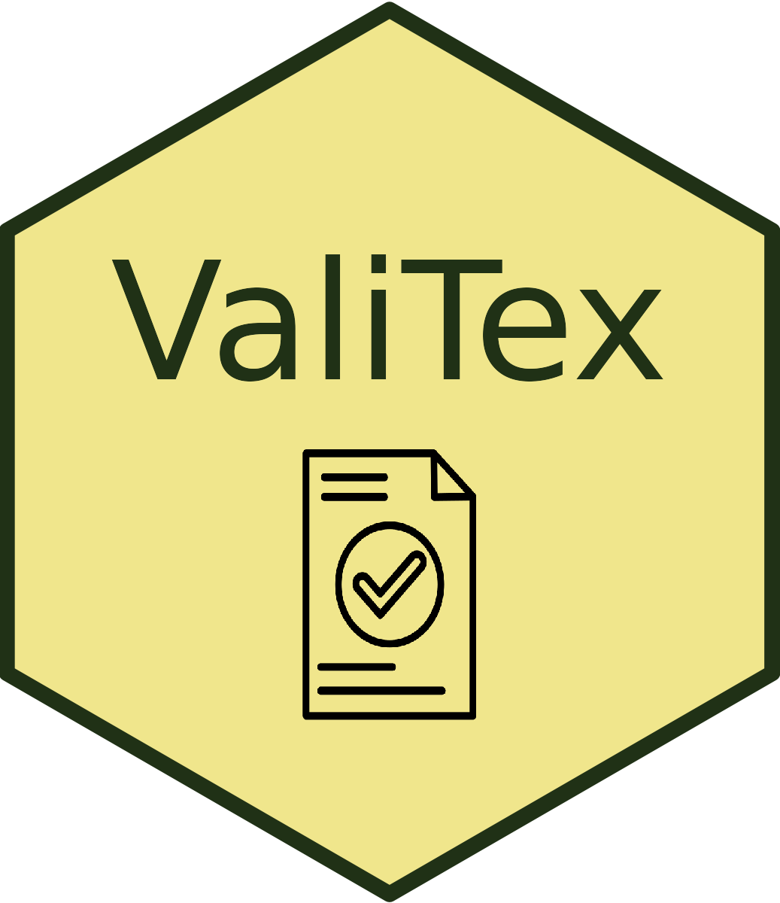

<!-- badges: start -->

[](http://www.repostatus.org/#active)
[](https://www.tidyverse.org/lifecycle/#experimental)

<!-- badges: end -->

# ValiTex Checklist

This repository contains the online checklist which accompanies the
[ValiTex](https://lukasbirki.shinyapps.io/ValiTex/) framework for
validating text-based measures of social science constructs by
Birkenmaier et al. (2023 forthcoming). The framework provides clear
guidelines for best practices in validation, with a normative stance on
what constitutes good validation evidence. For a detailed explanation,
please refer to the description in [Birkenmaier et al.
(2023)](https://arxiv.org/abs/2307.02863) or the "Theoretical
Background" section online webpage.

## Link to the Webpage

<https://lukasbirki.shinyapps.io/ValiTex/>

You can also run the online checklist locally on your machine using R.
You can install the package holding the shiny application directly from
Github using the `install_github` function from the `devtools` package
as shown below. Please make sure, that you have the `devtools` package
locally installed on your machine before starting the download.

``` r
install.packages("devtools")
devtools::install_github("lukasbirki/ValiTex")
```

## User Instructions

This application generates an adaptable checklist that you can use to
validate your text-based measures. Each row within the table corresponds
to one validation step (i.e., a single reported and clearly demarcated
validation activity). Validation steps can be either mandatory or
optional depending on their relevance . As outlined in the corresponding
paper, researchers should initially follow the order of the phases,
starting with the substantive validation steps and ending with external
validation steps while continuously considering robustness checks.
However, researchers might adapt this process to their individual use
case.

ValiTex accounts for differences in validation practices across
text-based methods and research contexts. At present, ValiTex
differentiates between four broad types of text-based methods:

-   Dictionary: Rule-based methods that include words or phrases along
    with their respective meanings or sentiments (e.g., SentiWS)
-   Supervised: Machine-learning methods that include some form of
    training data and test set and/or classification task (e.g., SVM,
    BERT)
-   Unsupervised (Topic Model): Unsupervised methods that generate
    topics based on word-occurrences (e.g., LDA)
-   Unsupervised (Text Scaling) Unsupervised methods that produce scores
    that relate to some underlying scale based on word-occurrences
    (e.g., Wordfish, Wordscores)

The complete list of validation steps is also available on
[Github](https://github.com/lukasbirki/ValiTex-Checklist/tree/main/data)
